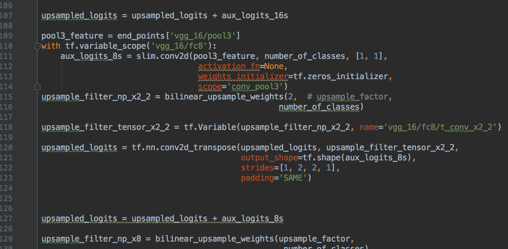

## 作业结果TinyMind地址
[quiz-w9](https://www.tinymind.com/executions/3awbf2vx)

## 心得
作业中实现的是基于VGG16的FCN，该FCN主要包括以下几个关键特点
#### 全卷积
对VGG16最后的全连接层都采用等价的卷积操作来替代。好处是能接受不同大小的图片输入，只是卷积到得到的最后不一定就是1 * 1 * 4096，而是缩减了32倍的n * n * 4096 feature maps。

#### 上采样（反卷积）
虽然上述得到的feature maps可以当作将图片分成32块做分类预测，但太粒度太粗，所以考虑将上述缩减了32倍的n * n * 4096 feature maps进行上采样，得到与原图长宽等大的feature maps。
最后结合图像处理领域常用有效的CRF对得到的feature maps进行处理，得到图片分割结果。

#### 多层特征跳接
* 由于上述的操作会把图片缩减成32倍的feature maps，即使反卷积，也是基于32倍来还原，得到的效果也不是非常好。
* 为了缓解弥补这种压缩损失，最初的上采样不直接做32倍上采样，而是做了2倍上采样，大小和VGG pooling4层的feature maps（做卷积将深度也统一为分类数）相同，将二者拼接起来，意味着能利用缩减倍数更少些的pooling4层的特征信息。该操作之后再通过16倍上采样得到与原图等大的feature maps。FCN原论文将这个结构的FCN命名为FCN-16s。
* 类似的，本次作业中要求实现的是FCN-8s，和FCN-16s差不多。具体就是基于FCN-16s，撤掉16倍上采样，继续用2倍上采样，得到的结果和VGG pooling3层的结果（做卷积将深度也统一为分类数）进行拼接，最后通过8倍的上采样得到与原图等大的feature maps。代码如下：

